# Inference Ops: Serving a 3-Stage Triage Agent on Qwen3.5-4B

**Case Study:** Deploying an inferencing infrastructure for an <u>enterprise support triage agent</u> for fictional B2B SaaS platform NovaCRM through a full inference gateway and running controlled experiments to find SLA approved engine configurations for mixed agentic workload.

## Table of Contents

1. [The System](#1-the-system)
2. [The Agentic Workload](#2-the-agentic-workload)
3. [Hypotheses and SLOs](#3-hypotheses-and-slos)
4. [how-fast: Minimal Benchmarking Library](#4-how-fast-minimal-benchmarking-library)
5. [Experiment Design](#5-experiment-design)
6. [Results: Configuration Ablation](#6-results-configuration-ablation)
7. [Results: Concurrency Sweep](#7-results-concurrency-sweep)
8. [Model and Instance Justification](#8-model-and-instance-justification)
9. [Observability and Dashboards](#9-observability-and-dashboards)
10. [InferenceOps: When Things Break](#10-inferenceops-when-things-break)
11. [Reflection](#11-reflection)
12. [Next Steps](#12-next-steps)

--- 

## 1. The System

Every request travels through four layers before reaching the GPU. Each layer adds latency, each layer can fail independently, and each layer exposes different metrics.

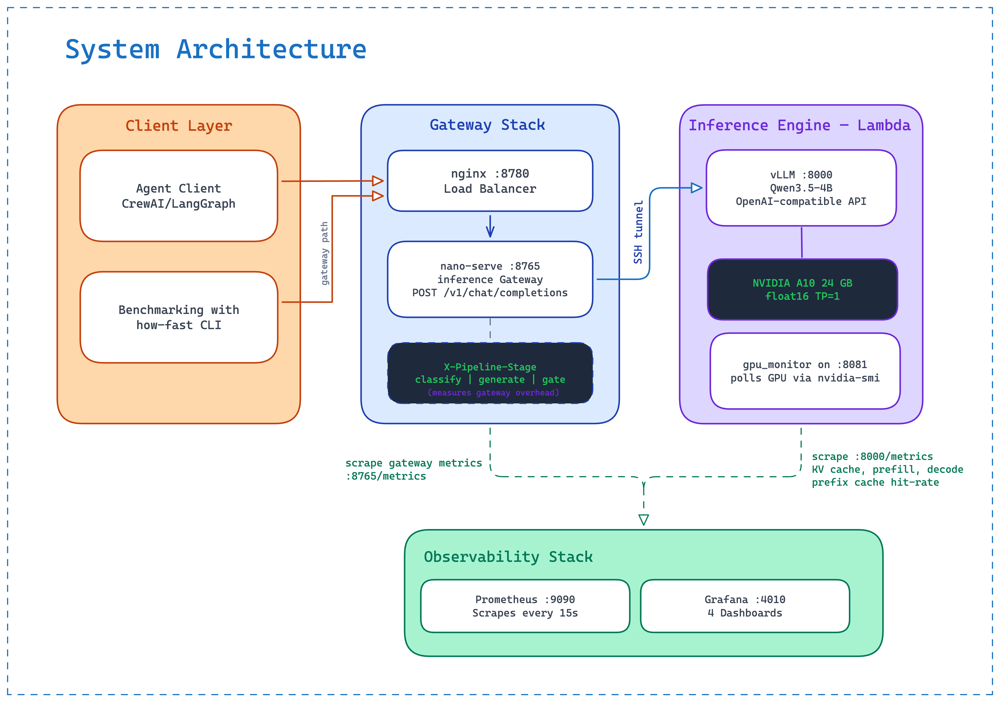


### Pinned Versions

| Component | Version |
|-----------|---------|
| Model | `Qwen/Qwen3.5-4B` (Apache 2.0, released Feb 2026) |
| vLLM | `v0.19.0` |
| GPU | NVIDIA A10 (24 GB VRAM), Lambda Cloud |
| Python | 3.12 |
| nano-serve | FastAPI + httpx (async) |
| Benchmarking | how-fast (custom library) |


---


## 2. The Agentic Workload

The benchmark replays a 3-stage enterprise support triage pipeline for a fictional B2B SaaS platform (NovaCRM). Each customer ticket passes through three sequential LLM calls with deliberately different inference profiles.

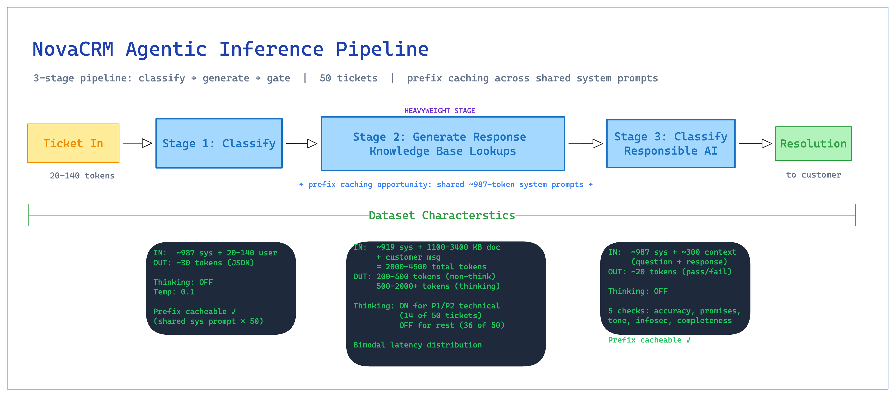


---

### Stage 1: Classify

- Reads the customer message and outputs a structured JSON routing decision: `{severity, category, summary}`.
- System prompt is identical across all 50 requests (~987 tokens) — maximum prefix cache opportunity

### Stage 2: Generate

- Drafts a knowledge-grounded customer response. The user prompt embeds the full KB document for the ticket's category.
- Input ranges from ~2,000 to ~4,500 tokens depending on category — the primary source of latency variance
- 14 of 50 tickets use **thinking mode ON** (P1/P2 technical tickets). These generate 500–2,000+ reasoning tokens before the visible response. Non-thinking tickets generate ~200 tokens.

### Stage 3: Gate

- Quality-checks the generated response against a 5-point rubric before it reaches the customer 
- Output is short JSON: `{pass, flags, reason}`. Fast when the cache is warm.


### Workload composition & Defining Mixed Workload

| File | Stage | Rows | Avg prompt tokens | Max output tokens | Thinking |
|------|-------|------|-------------------|-------------------|----------|
| `classify_requests.jsonl` | 1 | 50 | ~1,050 | 150 | OFF |
| `generate_requests.jsonl` | 2 | 50 | ~2,390 | 600 / 2,800 | 14 ON, 36 OFF |
| `gate_requests.jsonl` | 3 | 50 | ~1,200 | 200 | OFF |
| **`mixed.jsonl`** | all | **150** | varies | varies | mixed |

Interleaving Approach:
- Interleaves stages in a pipeline-staircase pattern — classify[N], generate[N-1], gate[N-2] arrive simultaneously. 
- At concurrency 4+, the engine's batch contains short classify prefills, long generate prefills, fast gate decodes, and extended thinking-mode decodes all at once. 
- Goal: Simulate realistic production challenge.


### What's simplified vs. production?

- No KB retrieval: Deterministic file lookup by category (vs. vector search in production) — intentional, to isolate inference measurement from retrieval infrastructure
- Gate stage uses pre-written plausible responses rather than live Stage 2 output — makes the benchmark self-contained and reproducible

---

## 3. Hypotheses and SLOs
### Hypotheses

Before running any experiments following three hypothesis were formed:

**1. Prefix caching will reduce classify and gate TTFT significantly.**
- All classify and gate requests share an identical ~987-token system prompt. 
- After the first request of each type populates the KV cache, subsequent requests skip that prefill entirely. 

**2. MTP-1 speculation will improve per-request decode speed but hurt batch throughput.**
- Qwen3.5-4B ships with a native Multi-Token Prediction (MTP) head. 
- With `num_speculative_tokens=1`, each decode step proposes 2 tokens, roughly doubling per-request token generation speed if the acceptance rate is high. 
- But speculative tokens consume KV cache, and on an A10 that VRAM pressure might reduce effective batch size at high concurrency.

```
Note on MTP:
- MTP natively supported in Qwen 3.5 series
- Architectural approach to speculative decoding where the "draft model" is built directly into the main model's architecture.
- MTP uses specialised prediction heads trained alongside the main model to predict multiple future tokens in a single forward pass. 
```

**3. MTP-3 will help tail latency at the cost of throughput.**
- Reusing the MTP head 3 times per step with degrading acceptance rates still helps the long thinking-mode requests (which are decode-bound for 1,000+ tokens). 
- But VRAM pressure at MTP-3 pushes against the A10's 24 GB limit at concurrency 32.

### SLOs

Defined from the customer's perspective — the person waiting for their support ticket to be resolved:

| SLO | Target | Justification |
|-----|--------|-----------|
| TTFT p95 | < 3s | Response indicator appears within 3s. Beyond this the system feels broken. |
| Total latency p50 | < 15s | Median ticket fully triaged in under 15s|
| Total latency p95 | < 120s | Even complex thinking-mode tickets complete within 2 minutes |
| Error rate | < 1% | Production reliability |
| Throughput | ≥ 1.0 req/s | One average A10 handles 60+ triages/minute |
| Cost per request | < $0.001 | Arbitrary |

## 4. how-fast: Minimal Benchmarking Library

how-fast is a purpose-built LLM benchmarking library I wrote for one key specific reason

> To streamline the LLM benchmarking lifecycle by automating remote deployment, full-stack metric tracking, and SLO validation through exhaustive configuration and concurrency/qps sweeps.

Here is the system architecture and workflow:

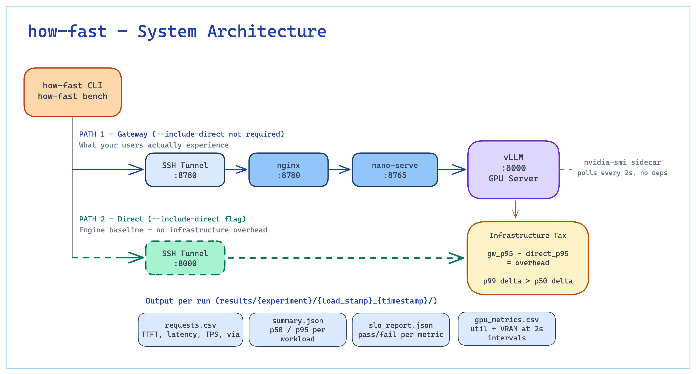

### Key features:
- **Generates self-contained launch scripts** for each experiment config (vLLM flags, model path, GPU type) as single shell scripts that can be SCP'd to any server
- **Runs structured benchmarks:** Controlled concurrency, fixed duration or exhaust workload mode, replaying real JSONL workloads
- **Evaluates SLOs automatically:** After each run, every metric is checked against thresholds in `config/slos.yaml`; results written to `slo_report.json` with pass/fail per metric per workload
- **Captures GPU telemetry** via a stdlib-only HTTP sidecar that shells out to `nvidia-smi` every 2 seconds, embedded as a heredoc in the launch script so nothing extra needs copying to the server

Here is the CLI workflow:

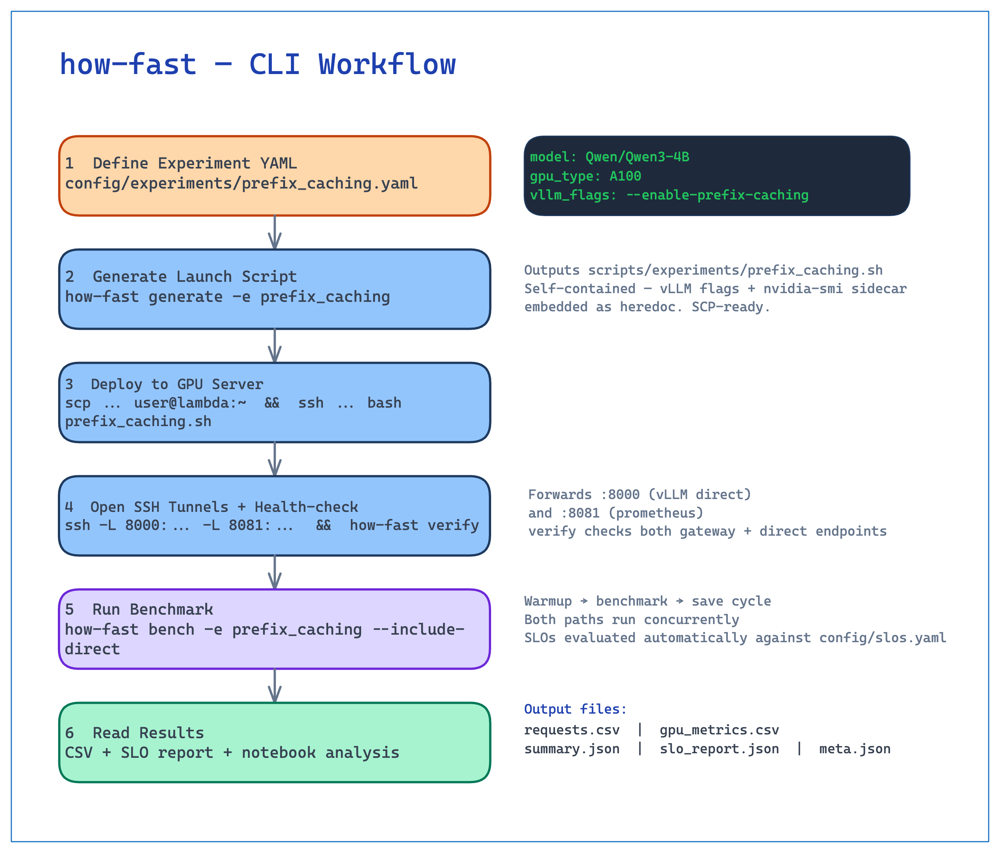

CLI commands include `bench`with flags for concurrency, QPS, duration, and more; `sweep` for running multiple concurrency/QPS levels back-to-back; and `report` for loading results and generating SLO validation reports and visualizations. Here is the architectural details of the two modes:

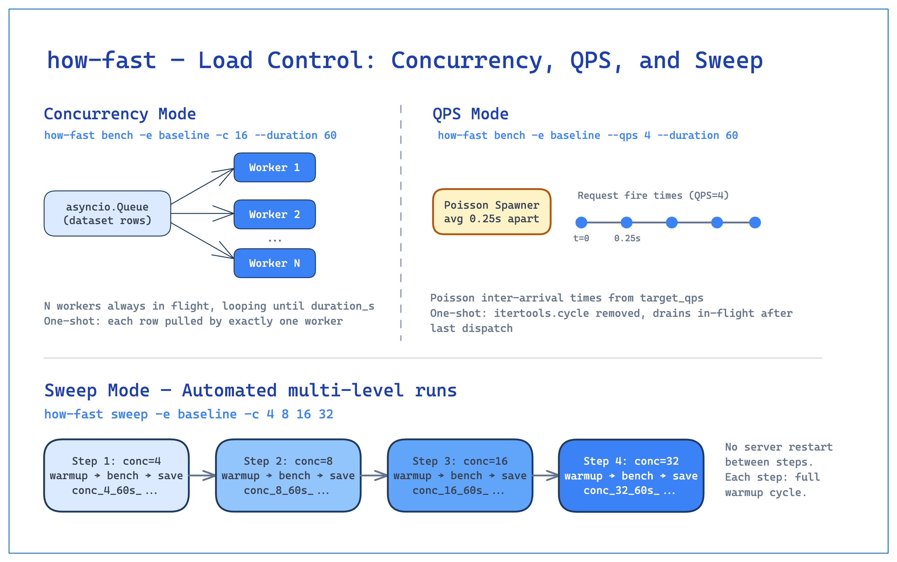

## 5. Experiment Design

### Two phases

**Phase 1: Configuration ablation:** 
- Four vLLM configurations, all at concurrency 32, full 150-request mixed workload. 
- Everything except the flags being tested is held constant.
- `Meta Learnings`: 
    - Not much difference at concurrency 1
    - Difference between fixed QPS and fixed concurrency
    - V1 Engine Chunked Prefill is always on
        -  When I tired to force turn it off: "This model does not officially support disabling chunked prefill. Disabling this manually may cause the engine to crash or produce incorrect outputs."
        - Source: https://vllm.website.cncfstack.com/configuration/optimization.html?utm_source=chatgpt.com#preemption

**Phase 2: Concurrency sweep:** 
- The winning configuration from Phase 1, swept across concurrency 4, 8, 16, 32, 64 to find where it meets and violates each SLO.

### What's held constant across all arms

- Model: `Qwen/Qwen3.5-4B`
- GPU: NVIDIA A10 (24 GB)
- `tensor_parallel_size: 1`, `gpu_memory_utilization: 0.90`, `dtype: float16`, 
- `max_model_len: 8192`, `max_num_seqs: 64`
- Chunked Prefill (V1 vLLM Engine always keeps it on!)
- Workload: `mixed.jsonl` — identical 150-request file for every arm


### Configuration arms (Phase 1)

| Arm | Label | Key flags | Hypothesis |
|-----|-------|-----------|------------|
| A | Baseline | No optimizations | Performance floor |
| B | Prefix Caching | `--enable-prefix-caching` | Shared system prompts drive large TTFT reduction |
| C | MTP-1 | `--enable-prefix-caching` + MTP `num_speculative_tokens=1` | Faster decode per request; VRAM cost at high concurrency |
| D | MTP-3 | `--enable-prefix-caching` + MTP `num_speculative_tokens=3` | Better latency; worse VRAM utilisation |

**Note on chunked prefill:** 
- vLLM V1 enables chunked prefill by default and it cannot be disabled. 
- All arms use the same `max_num_batched_tokens` so chunked prefill behavior is held constant and it is not an experiment variable.

**Note on Qwen3.5 + prefix caching:** 
- Qwen3.5's hybrid attention architecture (Gated Delta Networks) uses an experimental "align" mode for prefix caching in vLLM. vLLM logs a warning about this. 
- The feature worked without errors, during experimentation outputs were good but need to keep monitoring.


### Benchmarking Process

We are GPU Poor: single A10 GPU on Lambda only :)

For each arm:
1. Kill previous vLLM process, wait 5s
2. Start vLLM, wait for "Started server process" in logs
3. how-fast sends warmup requests (not counted in results)
4. how-fast: 150 requests, concurrency 32
5. Save CSV and vLLM logs
6. Repeat.

## 6. Results: Configuration Ablation

All arms at concurrency 32, run until mixed-workload.jsonl is exhausted. 
Note: Zero errors across all arms.


```python
import json
from pathlib import Path
import pandas as pd

RESULTS_DIR = Path("results")
ARM_ORDER = ["Baseline", "Prefix_Caching", "TP_Speculative_1", "TP_Speculative_3"]
ARM_LABELS = {
    "Baseline": "Baseline",
    "Prefix_Caching": "Prefix Caching",
    "TP_Speculative_1": "MTP-1 + Prefix Cache",
    "TP_Speculative_3": "MTP-3 + Prefix Cache",
}


def load_summary(arm: str) -> dict:
    run_dir = sorted((RESULTS_DIR / arm).glob("conc_32_*"))[-1]
    with open(run_dir / "summary.json") as f:
        return json.load(f)[0]


rows = [load_summary(arm) for arm in ARM_ORDER]
df = pd.DataFrame(rows)

# Derive throughput in requests per minute
if "throughput_rps" in df.columns:
    df["throughput_rpm"] = df["throughput_rps"].fillna(0) * 60
else:
    df["throughput_rpm"] = pd.NA

cols = {
    "experiment": "Arm",
    "n_requests": "Requests",
    "n_errors": "Errors",
    "throughput_rpm": "Throughput (RPM)",
    "ttft_p50_s": "TTFT p50 (s)",
    "ttft_p95_s": "TTFT p95 (s)",
    "total_latency_p50_s": "Lat p50 (s)",
    "total_latency_p95_s": "Lat p95 (s)",
    "tps_p50": "TPS p50",
    "tps_p95": "TPS p95",
    "mean_gpu_util_pct": "GPU Util %",
    "peak_vram_mb": "Peak VRAM (MB)",
    "cost_per_request_usd": "Cost/Req ($)",
}
display_df = df[list(cols.keys())].rename(columns=cols)
display_df["Arm"] = display_df["Arm"].map(ARM_LABELS).fillna(display_df["Arm"])
display_df.set_index("Arm", inplace=True)

# Dark-mode-friendly styling: underline best/worst instead of background colors
def _underline_min(s):
    is_min = s == s.min()
    return ["text-decoration: underline; text-decoration-color: #55cc88; text-underline-offset: 3px; font-weight: bold" if v else "" for v in is_min]

def _underline_max(s):
    is_max = s == s.max()
    return ["text-decoration: underline; text-decoration-color: #55cc88; text-underline-offset: 3px; font-weight: bold" if v else "" for v in is_max]

def _underline_max_warn(s):
    is_max = s == s.max()
    return ["text-decoration: underline; text-decoration-color: #ff6b6b; text-underline-offset: 3px; font-weight: bold" if v else "" for v in is_max]

display_df.style \
    .set_caption("Configuration Ablation — Concurrency 32, Mixed Workload") \
    .format({
        "Throughput (RPM)": "{:.1f}",
        "TTFT p50 (s)": "{:.3f}",
        "TTFT p95 (s)": "{:.3f}",
        "Lat p50 (s)": "{:.3f}",
        "Lat p95 (s)": "{:.3f}",
        "TPS p50": "{:.2f}",
        "TPS p95": "{:.2f}",
        "GPU Util %": "{:.1f}",
        "Peak VRAM (MB)": "{:,.0f}",
        "Cost/Req ($)": "{:.6f}",
    }) \
    .apply(_underline_min, subset=["TTFT p50 (s)", "TTFT p95 (s)", "Lat p50 (s)", "Lat p95 (s)", "Cost/Req ($)"]) \
    .apply(_underline_max, subset=["TPS p50", "TPS p95", "Throughput (RPM)"]) \
    .apply(_underline_max_warn, subset=["Peak VRAM (MB)"])
```


<style type="text/css">
#T_1b438_row1_col2, #T_1b438_row1_col3, #T_1b438_row1_col4, #T_1b438_row1_col5, #T_1b438_row1_col7, #T_1b438_row1_col8, #T_1b438_row3_col6, #T_1b438_row3_col11 {
  text-decoration: underline;
  text-decoration-color: #55cc88;
  text-underline-offset: 3px;
  font-weight: bold;
}
#T_1b438_row3_col10 {
  text-decoration: underline;
  text-decoration-color: #ff6b6b;
  text-underline-offset: 3px;
  font-weight: bold;
}
</style>
<table id="T_1b438">
  <caption>Configuration Ablation — Concurrency 32, Mixed Workload</caption>
  <thead>
    <tr>
      <th class="blank level0" >&nbsp;</th>
      <th id="T_1b438_level0_col0" class="col_heading level0 col0" >Requests</th>
      <th id="T_1b438_level0_col1" class="col_heading level0 col1" >Errors</th>
      <th id="T_1b438_level0_col2" class="col_heading level0 col2" >Throughput (RPM)</th>
      <th id="T_1b438_level0_col3" class="col_heading level0 col3" >TTFT p50 (s)</th>
      <th id="T_1b438_level0_col4" class="col_heading level0 col4" >TTFT p95 (s)</th>
      <th id="T_1b438_level0_col5" class="col_heading level0 col5" >Lat p50 (s)</th>
      <th id="T_1b438_level0_col6" class="col_heading level0 col6" >Lat p95 (s)</th>
      <th id="T_1b438_level0_col7" class="col_heading level0 col7" >TPS p50</th>
      <th id="T_1b438_level0_col8" class="col_heading level0 col8" >TPS p95</th>
      <th id="T_1b438_level0_col9" class="col_heading level0 col9" >GPU Util %</th>
      <th id="T_1b438_level0_col10" class="col_heading level0 col10" >Peak VRAM (MB)</th>
      <th id="T_1b438_level0_col11" class="col_heading level0 col11" >Cost/Req ($)</th>
    </tr>
    <tr>
      <th class="index_name level0" >Arm</th>
      <th class="blank col0" >&nbsp;</th>
      <th class="blank col1" >&nbsp;</th>
      <th class="blank col2" >&nbsp;</th>
      <th class="blank col3" >&nbsp;</th>
      <th class="blank col4" >&nbsp;</th>
      <th class="blank col5" >&nbsp;</th>
      <th class="blank col6" >&nbsp;</th>
      <th class="blank col7" >&nbsp;</th>
      <th class="blank col8" >&nbsp;</th>
      <th class="blank col9" >&nbsp;</th>
      <th class="blank col10" >&nbsp;</th>
      <th class="blank col11" >&nbsp;</th>
    </tr>
  </thead>
  <tbody>
    <tr>
      <th id="T_1b438_level0_row0" class="row_heading level0 row0" >Baseline</th>
      <td id="T_1b438_row0_col0" class="data row0 col0" >150</td>
      <td id="T_1b438_row0_col1" class="data row0 col1" >0</td>
      <td id="T_1b438_row0_col2" class="data row0 col2" >0.0</td>
      <td id="T_1b438_row0_col3" class="data row0 col3" >1.775</td>
      <td id="T_1b438_row0_col4" class="data row0 col4" >11.124</td>
      <td id="T_1b438_row0_col5" class="data row0 col5" >12.429</td>
      <td id="T_1b438_row0_col6" class="data row0 col6" >105.020</td>
      <td id="T_1b438_row0_col7" class="data row0 col7" >8.08</td>
      <td id="T_1b438_row0_col8" class="data row0 col8" >13.79</td>
      <td id="T_1b438_row0_col9" class="data row0 col9" >98.1</td>
      <td id="T_1b438_row0_col10" class="data row0 col10" >19,771</td>
      <td id="T_1b438_row0_col11" class="data row0 col11" >0.000317</td>
    </tr>
    <tr>
      <th id="T_1b438_level0_row1" class="row_heading level0 row1" >Prefix Caching</th>
      <td id="T_1b438_row1_col0" class="data row1 col0" >150</td>
      <td id="T_1b438_row1_col1" class="data row1 col1" >0</td>
      <td id="T_1b438_row1_col2" class="data row1 col2" >70.3</td>
      <td id="T_1b438_row1_col3" class="data row1 col3" >0.973</td>
      <td id="T_1b438_row1_col4" class="data row1 col4" >4.873</td>
      <td id="T_1b438_row1_col5" class="data row1 col5" >7.576</td>
      <td id="T_1b438_row1_col6" class="data row1 col6" >100.944</td>
      <td id="T_1b438_row1_col7" class="data row1 col7" >12.77</td>
      <td id="T_1b438_row1_col8" class="data row1 col8" >17.70</td>
      <td id="T_1b438_row1_col9" class="data row1 col9" >97.9</td>
      <td id="T_1b438_row1_col10" class="data row1 col10" >20,849</td>
      <td id="T_1b438_row1_col11" class="data row1 col11" >0.000261</td>
    </tr>
    <tr>
      <th id="T_1b438_level0_row2" class="row_heading level0 row2" >MTP-1 + Prefix Cache</th>
      <td id="T_1b438_row2_col0" class="data row2 col0" >150</td>
      <td id="T_1b438_row2_col1" class="data row2 col1" >0</td>
      <td id="T_1b438_row2_col2" class="data row2 col2" >0.0</td>
      <td id="T_1b438_row2_col3" class="data row2 col3" >1.460</td>
      <td id="T_1b438_row2_col4" class="data row2 col4" >7.626</td>
      <td id="T_1b438_row2_col5" class="data row2 col5" >10.067</td>
      <td id="T_1b438_row2_col6" class="data row2 col6" >100.447</td>
      <td id="T_1b438_row2_col7" class="data row2 col7" >5.71</td>
      <td id="T_1b438_row2_col8" class="data row2 col8" >9.03</td>
      <td id="T_1b438_row2_col9" class="data row2 col9" >94.2</td>
      <td id="T_1b438_row2_col10" class="data row2 col10" >21,147</td>
      <td id="T_1b438_row2_col11" class="data row2 col11" >0.000270</td>
    </tr>
    <tr>
      <th id="T_1b438_level0_row3" class="row_heading level0 row3" >MTP-3 + Prefix Cache</th>
      <td id="T_1b438_row3_col0" class="data row3 col0" >150</td>
      <td id="T_1b438_row3_col1" class="data row3 col1" >0</td>
      <td id="T_1b438_row3_col2" class="data row3 col2" >0.0</td>
      <td id="T_1b438_row3_col3" class="data row3 col3" >2.781</td>
      <td id="T_1b438_row3_col4" class="data row3 col4" >9.082</td>
      <td id="T_1b438_row3_col5" class="data row3 col5" >10.793</td>
      <td id="T_1b438_row3_col6" class="data row3 col6" >82.295</td>
      <td id="T_1b438_row3_col7" class="data row3 col7" >3.25</td>
      <td id="T_1b438_row3_col8" class="data row3 col8" >5.13</td>
      <td id="T_1b438_row3_col9" class="data row3 col9" >93.4</td>
      <td id="T_1b438_row3_col10" class="data row3 col10" >22,467</td>
      <td id="T_1b438_row3_col11" class="data row3 col11" >0.000249</td>
    </tr>
  </tbody>
</table>


```python
import matplotlib.pyplot as plt
import numpy as np
from matplotlib.patches import Patch

plt.rcParams.update({"figure.dpi": 150, "savefig.dpi": 150})

arms = ARM_ORDER
labels = [ARM_LABELS[a] for a in arms]
x = np.arange(len(arms))
data = {arm: load_summary(arm) for arm in arms}

COLORS = ["#4C72B0", "#55A868", "#C44E52", "#8172B2"]

metrics = [
    ("TTFT", "ttft_{}_s", "seconds"),
    ("End-to-End Latency", "total_latency_{}_s", "seconds"),
    ("Tokens per Second", "tps_{}", "tokens/s"),
]

fig, axes = plt.subplots(2, 3, figsize=(18, 9))
fig.suptitle("Configuration Ablation — Concurrency 32", fontsize=14, fontweight="bold", y=1.02)

# Color legend at top — arm identity
legend_handles = [Patch(facecolor=c, label=l) for c, l in zip(COLORS, labels)]
fig.legend(
    handles=legend_handles,
    loc="upper center",
    ncol=len(labels),
    fontsize=10,
    frameon=False,
    bbox_to_anchor=(0.5, 0.99),
)

for row_idx, percentile in enumerate(["p50", "p95"]):
    for col_idx, (title, key_tmpl, unit) in enumerate(metrics):
        ax = axes[row_idx, col_idx]
        key = key_tmpl.format(percentile)
        vals = [data[a][key] for a in arms]
        bars = ax.bar(x, vals, color=COLORS, alpha=0.88, width=0.55, edgecolor="white", linewidth=0.5)
        ax.set_title(f"{title} — {percentile.upper()}", fontsize=11, fontweight="bold")
        ax.set_ylabel(unit, fontsize=10)
        # Single centered tick labeled "mixed" — conveys the workload like analysis.ipynb
        ax.set_xticks([np.mean(x)])
        ax.set_xticklabels(["mixed"], fontsize=9, color="gray")
        ax.set_xlabel("workload", fontsize=8, color="gray")
        ax.grid(axis="y", alpha=0.3, linewidth=0.5)
        ax.spines["top"].set_visible(False)
        ax.spines["right"].set_visible(False)
        for bar, v in zip(bars, vals):
            ax.text(
                bar.get_x() + bar.get_width() / 2, bar.get_height(),
                f"{v:.2f}" if v < 100 else f"{v:.1f}",
                ha="center", va="bottom", fontsize=8, fontweight="bold",
            )

plt.tight_layout()
plt.show()
```


    
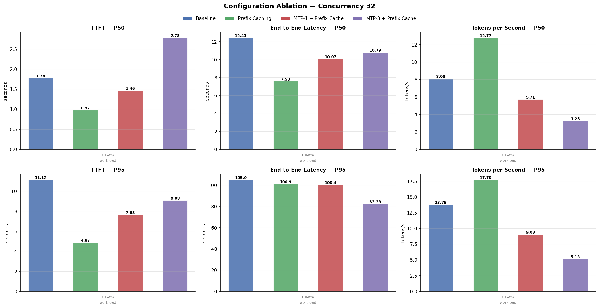
    


```python
A10_VRAM_GB = 24.0
import pandas as pd

peak_vram = [data[a]["peak_vram_mb"] / 1024 for a in arms]
mean_vram = [data[a]["mean_vram_mb"] / 1024 for a in arms]
w = 0.35

# ── Chart 1: VRAM pressure — arm names on x-axis ──
fig1, ax1 = plt.subplots(figsize=(12, 5))

bars_mean = ax1.bar(x - w / 2, mean_vram, w, label="Mean VRAM", color="#4C72B0", alpha=0.88, edgecolor="white", linewidth=0.5)
bars_peak = ax1.bar(x + w / 2, peak_vram, w, label="Peak VRAM", color="#C44E52", alpha=0.88, edgecolor="white", linewidth=0.5)
ax1.axhline(A10_VRAM_GB, color="gray", linestyle="--", linewidth=1.2, label=f"A10 capacity ({A10_VRAM_GB:.0f} GB)")
ax1.set_ylim(0, A10_VRAM_GB * 1.12)
ax1.set_title("GPU Memory Pressure (Concurrency 32)", fontsize=12, fontweight="bold")
ax1.set_ylabel("VRAM (GB)", fontsize=10)
ax1.set_xticks(x)
ax1.set_xticklabels(labels, rotation=12, ha="right", fontsize=9)
ax1.legend(loc="lower right", fontsize=9)
ax1.grid(axis="y", alpha=0.3, linewidth=0.5)
ax1.spines["top"].set_visible(False)
ax1.spines["right"].set_visible(False)

for bar, v in zip(bars_peak, peak_vram):
    pct = v / A10_VRAM_GB * 100
    label_color = "#C44E52" if pct > 90 else "#4C72B0"
    ax1.text(
        bar.get_x() + bar.get_width() / 2, bar.get_height() + 0.15,
        f"{v:.1f} GB\n({pct:.0f}%)",
        ha="center", va="bottom", fontsize=9, color=label_color, fontweight="bold",
    )

plt.tight_layout()
plt.show()

# ── Chart 2: GPU utilization over time — full width ──
fig2, ax2 = plt.subplots(figsize=(14, 5))

for arm, color in zip(arms, COLORS):
    run_dir = sorted((RESULTS_DIR / arm).glob("conc_32_*"))[-1]
    gpu_df = pd.read_csv(run_dir / "gpu_metrics.csv")
    gpu_df["timestamp_utc"] = pd.to_datetime(gpu_df["timestamp_utc"])
    elapsed = (gpu_df["timestamp_utc"] - gpu_df["timestamp_utc"].iloc[0]).dt.total_seconds()
    ax2.plot(elapsed, gpu_df["gpu_util_pct"], label=ARM_LABELS[arm], color=color, linewidth=1.6, alpha=0.88)

ax2.set_title("GPU Utilization Over Time (Concurrency 32)", fontsize=12, fontweight="bold")
ax2.set_xlabel("Time (s)", fontsize=10)
ax2.set_ylabel("GPU Utilization %", fontsize=10)
ax2.set_ylim(0, 105)
ax2.legend(fontsize=10, loc="lower right")
ax2.grid(alpha=0.3, linewidth=0.5)
ax2.spines["top"].set_visible(False)
ax2.spines["right"].set_visible(False)

plt.tight_layout()
plt.show()
```


    
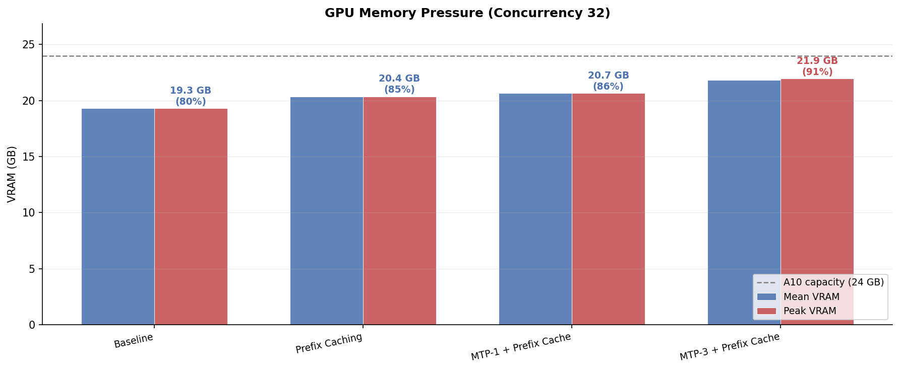
    


    
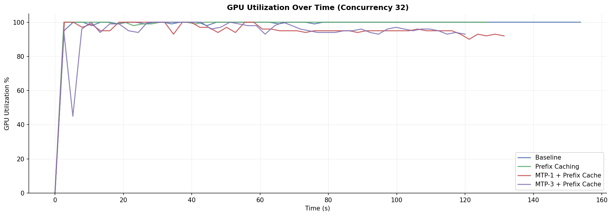
    


### Key findings

**Prefix Caching is the clear winner for this workload.**

- TTFT p50: 1.78s → 0.97s **(45% reduction)**
- TTFT p95: 11.1s → 4.87s **(56% reduction)**
- Total latency p50: 12.4s → 7.6s (39% reduction)
- TPS p50: 8.1 → 12.8 (58% improvement)
- Cost per request: 18% reduction

The shared system prompts are doing exactly what the hypothesis predicted. After the first request of each stage type, subsequent requests skip ~987 tokens of prefill entirely.

**MTP-1 shows a mixed profile.**

- Inherits the prefix caching TTFT benefit (1.46s p50 vs 1.78s baseline)
- But TPS p50 drops to 5.7 — worse than the baseline 8.1
- Root cause: speculative tokens consume KV cache. Peak VRAM jumped from 19.8 GB (baseline) to 21.1 GB. At concurrency 32, this pressure reduces effective batch size enough to hurt aggregate throughput even though individual decode is faster.

**MTP-3 has the best tail latency but worst everything else.**

- Total latency p95: 82.3s — lowest of all arms, confirming the hypothesis that thinking-mode requests benefit from aggressive speculation
- But: TPS p50 collapses to 3.3, TTFT p50 is the worst at 2.78s, peak VRAM hits 22.5 GB (93.8% of the A10)
- The A10's KV cache is nearly full at concurrency 32. The engine starts preempting requests to free space, killing throughput.


### Takeaway

- For a high-concurrency agentic workload, on a memory-constrained A10, **prefix caching alone is the right choice**. 

- MTP speculation makes sense on higher-VRAM hardware (A100, H100) where KV cache is not the bottleneck, or at low concurrency where the extra memory overhead doesn't crowd out batch capacity.

## 7. Results: Concurrency Sweep

Prefix caching configuration, concurrency 4 → 8 → 16 → 32 → 64. All runs: 150 requests.


```python
import json, re
from pathlib import Path
import pandas as pd

SWEEP_DIR = RESULTS_DIR / "Prefix_Caching"

sweep_rows = []
for run_dir in sorted(SWEEP_DIR.glob("conc_*")):
    m = re.match(r"conc_(\d+)_", run_dir.name)
    if not m:
        continue
    with open(run_dir / "summary.json") as f:
        entry = json.load(f)[0]
    entry["concurrency"] = int(m.group(1))
    entry["throughput_rpm"] = entry.get("throughput_rps", 0) * 60
    sweep_rows.append(entry)

sweep_df = pd.DataFrame(sweep_rows).sort_values("concurrency").reset_index(drop=True)

cols = {
    "concurrency": "Concurrency",
    "n_requests": "Requests",
    "n_errors": "Errors",
    "throughput_rpm": "Throughput (RPM)",
    "ttft_p50_s": "TTFT p50 (s)",
    "ttft_p95_s": "TTFT p95 (s)",
    "total_latency_p50_s": "Lat p50 (s)",
    "total_latency_p95_s": "Lat p95 (s)",
    "tps_p50": "TPS p50",
    "tps_p95": "TPS p95",
    "mean_gpu_util_pct": "GPU Util %",
    "peak_vram_mb": "Peak VRAM (MB)",
    "cost_per_request_usd": "Cost/Req ($)",
}
sweep_display = sweep_df[list(cols.keys())].rename(columns=cols).set_index("Concurrency")

sweep_display.style \
    .set_caption("Concurrency Sweep — Prefix Caching, Mixed Workload") \
    .format({
        "Throughput (RPM)": "{:.1f}",
        "TTFT p50 (s)": "{:.3f}",
        "TTFT p95 (s)": "{:.3f}",
        "Lat p50 (s)": "{:.3f}",
        "Lat p95 (s)": "{:.3f}",
        "TPS p50": "{:.2f}",
        "TPS p95": "{:.2f}",
        "GPU Util %": "{:.1f}",
        "Peak VRAM (MB)": "{:,.0f}",
        "Cost/Req ($)": "{:.6f}",
    })
```


<style type="text/css">
</style>
<table id="T_99072">
  <caption>Concurrency Sweep — Prefix Caching, Mixed Workload</caption>
  <thead>
    <tr>
      <th class="blank level0" >&nbsp;</th>
      <th id="T_99072_level0_col0" class="col_heading level0 col0" >Requests</th>
      <th id="T_99072_level0_col1" class="col_heading level0 col1" >Errors</th>
      <th id="T_99072_level0_col2" class="col_heading level0 col2" >Throughput (RPM)</th>
      <th id="T_99072_level0_col3" class="col_heading level0 col3" >TTFT p50 (s)</th>
      <th id="T_99072_level0_col4" class="col_heading level0 col4" >TTFT p95 (s)</th>
      <th id="T_99072_level0_col5" class="col_heading level0 col5" >Lat p50 (s)</th>
      <th id="T_99072_level0_col6" class="col_heading level0 col6" >Lat p95 (s)</th>
      <th id="T_99072_level0_col7" class="col_heading level0 col7" >TPS p50</th>
      <th id="T_99072_level0_col8" class="col_heading level0 col8" >TPS p95</th>
      <th id="T_99072_level0_col9" class="col_heading level0 col9" >GPU Util %</th>
      <th id="T_99072_level0_col10" class="col_heading level0 col10" >Peak VRAM (MB)</th>
      <th id="T_99072_level0_col11" class="col_heading level0 col11" >Cost/Req ($)</th>
    </tr>
    <tr>
      <th class="index_name level0" >Concurrency</th>
      <th class="blank col0" >&nbsp;</th>
      <th class="blank col1" >&nbsp;</th>
      <th class="blank col2" >&nbsp;</th>
      <th class="blank col3" >&nbsp;</th>
      <th class="blank col4" >&nbsp;</th>
      <th class="blank col5" >&nbsp;</th>
      <th class="blank col6" >&nbsp;</th>
      <th class="blank col7" >&nbsp;</th>
      <th class="blank col8" >&nbsp;</th>
      <th class="blank col9" >&nbsp;</th>
      <th class="blank col10" >&nbsp;</th>
      <th class="blank col11" >&nbsp;</th>
    </tr>
  </thead>
  <tbody>
    <tr>
      <th id="T_99072_level0_row0" class="row_heading level0 row0" >4</th>
      <td id="T_99072_row0_col0" class="data row0 col0" >150</td>
      <td id="T_99072_row0_col1" class="data row0 col1" >0</td>
      <td id="T_99072_row0_col2" class="data row0 col2" >24.1</td>
      <td id="T_99072_row0_col3" class="data row0 col3" >0.631</td>
      <td id="T_99072_row0_col4" class="data row0 col4" >1.354</td>
      <td id="T_99072_row0_col5" class="data row0 col5" >3.166</td>
      <td id="T_99072_row0_col6" class="data row0 col6" >70.133</td>
      <td id="T_99072_row0_col7" class="data row0 col7" >28.73</td>
      <td id="T_99072_row0_col8" class="data row0 col8" >37.42</td>
      <td id="T_99072_row0_col9" class="data row0 col9" >99.2</td>
      <td id="T_99072_row0_col10" class="data row0 col10" >20,651</td>
      <td id="T_99072_row0_col11" class="data row0 col11" >0.000761</td>
    </tr>
    <tr>
      <th id="T_99072_level0_row1" class="row_heading level0 row1" >8</th>
      <td id="T_99072_row1_col0" class="data row1 col0" >150</td>
      <td id="T_99072_row1_col1" class="data row1 col1" >0</td>
      <td id="T_99072_row1_col2" class="data row1 col2" >39.0</td>
      <td id="T_99072_row1_col3" class="data row1 col3" >0.638</td>
      <td id="T_99072_row1_col4" class="data row1 col4" >1.550</td>
      <td id="T_99072_row1_col5" class="data row1 col5" >3.572</td>
      <td id="T_99072_row1_col6" class="data row1 col6" >78.297</td>
      <td id="T_99072_row1_col7" class="data row1 col7" >26.22</td>
      <td id="T_99072_row1_col8" class="data row1 col8" >32.83</td>
      <td id="T_99072_row1_col9" class="data row1 col9" >98.7</td>
      <td id="T_99072_row1_col10" class="data row1 col10" >20,723</td>
      <td id="T_99072_row1_col11" class="data row1 col11" >0.000470</td>
    </tr>
    <tr>
      <th id="T_99072_level0_row2" class="row_heading level0 row2" >16</th>
      <td id="T_99072_row2_col0" class="data row2 col0" >150</td>
      <td id="T_99072_row2_col1" class="data row2 col1" >0</td>
      <td id="T_99072_row2_col2" class="data row2 col2" >55.6</td>
      <td id="T_99072_row2_col3" class="data row2 col3" >0.717</td>
      <td id="T_99072_row2_col4" class="data row2 col4" >2.600</td>
      <td id="T_99072_row2_col5" class="data row2 col5" >4.621</td>
      <td id="T_99072_row2_col6" class="data row2 col6" >93.223</td>
      <td id="T_99072_row2_col7" class="data row2 col7" >21.61</td>
      <td id="T_99072_row2_col8" class="data row2 col8" >27.32</td>
      <td id="T_99072_row2_col9" class="data row2 col9" >96.8</td>
      <td id="T_99072_row2_col10" class="data row2 col10" >20,723</td>
      <td id="T_99072_row2_col11" class="data row2 col11" >0.000330</td>
    </tr>
    <tr>
      <th id="T_99072_level0_row3" class="row_heading level0 row3" >32</th>
      <td id="T_99072_row3_col0" class="data row3 col0" >150</td>
      <td id="T_99072_row3_col1" class="data row3 col1" >0</td>
      <td id="T_99072_row3_col2" class="data row3 col2" >70.3</td>
      <td id="T_99072_row3_col3" class="data row3 col3" >0.973</td>
      <td id="T_99072_row3_col4" class="data row3 col4" >4.873</td>
      <td id="T_99072_row3_col5" class="data row3 col5" >7.576</td>
      <td id="T_99072_row3_col6" class="data row3 col6" >100.944</td>
      <td id="T_99072_row3_col7" class="data row3 col7" >12.77</td>
      <td id="T_99072_row3_col8" class="data row3 col8" >17.70</td>
      <td id="T_99072_row3_col9" class="data row3 col9" >97.9</td>
      <td id="T_99072_row3_col10" class="data row3 col10" >20,849</td>
      <td id="T_99072_row3_col11" class="data row3 col11" >0.000261</td>
    </tr>
    <tr>
      <th id="T_99072_level0_row4" class="row_heading level0 row4" >64</th>
      <td id="T_99072_row4_col0" class="data row4 col0" >150</td>
      <td id="T_99072_row4_col1" class="data row4 col1" >0</td>
      <td id="T_99072_row4_col2" class="data row4 col2" >75.8</td>
      <td id="T_99072_row4_col3" class="data row4 col3" >1.607</td>
      <td id="T_99072_row4_col4" class="data row4 col4" >11.046</td>
      <td id="T_99072_row4_col5" class="data row4 col5" >14.047</td>
      <td id="T_99072_row4_col6" class="data row4 col6" >101.198</td>
      <td id="T_99072_row4_col7" class="data row4 col7" >6.91</td>
      <td id="T_99072_row4_col8" class="data row4 col8" >15.67</td>
      <td id="T_99072_row4_col9" class="data row4 col9" >97.7</td>
      <td id="T_99072_row4_col10" class="data row4 col10" >22,369</td>
      <td id="T_99072_row4_col11" class="data row4 col11" >0.000242</td>
    </tr>
  </tbody>
</table>


```python
import matplotlib.pyplot as plt
import numpy as np

plt.rcParams.update({"figure.dpi": 150, "savefig.dpi": 150})

conc = sweep_df["concurrency"].values
ttft_p50 = sweep_df["ttft_p50_s"].values
ttft_p95 = sweep_df["ttft_p95_s"].values

fig, ax = plt.subplots(figsize=(10, 5))

ax.plot(conc, ttft_p50, "o-", color="#4C72B0", linewidth=2, markersize=7, label="TTFT p50")
ax.plot(conc, ttft_p95, "s-", color="#C44E52", linewidth=2, markersize=7, label="TTFT p95")
ax.axhline(3.0, color="gray", linestyle="--", linewidth=1.2, label="SLO: 3s")

# Shade SLO violation region
ax.axhspan(3.0, ax.get_ylim()[1] + 5, alpha=0.06, color="red")

for xi, p50, p95 in zip(conc, ttft_p50, ttft_p95):
    ax.annotate(f"{p50:.2f}", (xi, p50), textcoords="offset points", xytext=(0, -14), fontsize=8, ha="center", color="#4C72B0")
    ax.annotate(f"{p95:.2f}", (xi, p95), textcoords="offset points", xytext=(0, 8), fontsize=8, ha="center", color="#C44E52")

ax.set_title("TTFT vs Concurrency — Prefix Caching", fontsize=12, fontweight="bold")
ax.set_xlabel("Concurrency", fontsize=10)
ax.set_ylabel("Time to First Token (s)", fontsize=10)
ax.set_xticks(conc)
ax.legend(fontsize=10)
ax.grid(alpha=0.3, linewidth=0.5)
ax.spines["top"].set_visible(False)
ax.spines["right"].set_visible(False)

plt.tight_layout()
plt.show()
```


    
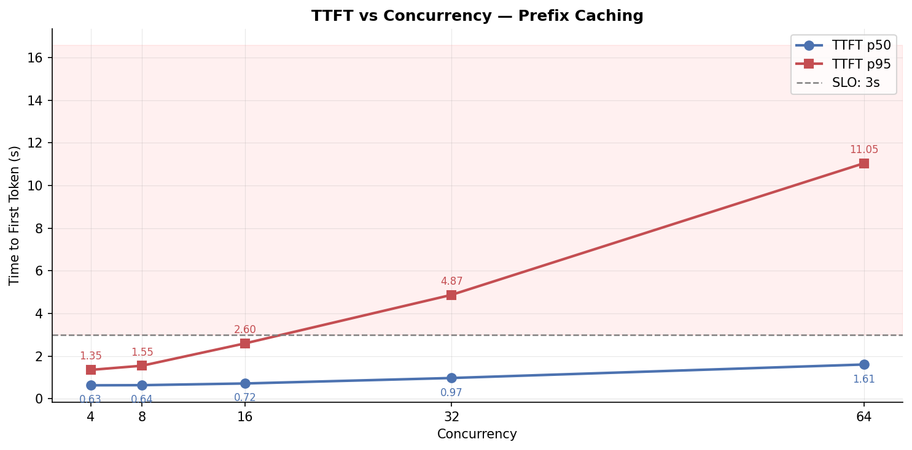
    


```python
lat_p50 = sweep_df["total_latency_p50_s"].values
lat_p95 = sweep_df["total_latency_p95_s"].values

fig, ax = plt.subplots(figsize=(10, 5))

ax.plot(conc, lat_p50, "o-", color="#4C72B0", linewidth=2, markersize=7, label="Latency p50")
ax.plot(conc, lat_p95, "s-", color="#C44E52", linewidth=2, markersize=7, label="Latency p95")
ax.axhline(15.0, color="#4C72B0", linestyle="--", linewidth=1.2, alpha=0.7, label="SLO p50: 15s")
ax.axhline(120.0, color="#C44E52", linestyle="--", linewidth=1.2, alpha=0.7, label="SLO p95: 120s")

for xi, p50, p95 in zip(conc, lat_p50, lat_p95):
    ax.annotate(f"{p50:.1f}", (xi, p50), textcoords="offset points", xytext=(0, -14), fontsize=8, ha="center", color="#4C72B0")
    ax.annotate(f"{p95:.1f}", (xi, p95), textcoords="offset points", xytext=(0, 8), fontsize=8, ha="center", color="#C44E52")

ax.set_title("Total Latency vs Concurrency — Prefix Caching", fontsize=12, fontweight="bold")
ax.set_xlabel("Concurrency", fontsize=10)
ax.set_ylabel("Total Latency (s)", fontsize=10)
ax.set_xticks(conc)
ax.legend(fontsize=10)
ax.grid(alpha=0.3, linewidth=0.5)
ax.spines["top"].set_visible(False)
ax.spines["right"].set_visible(False)

plt.tight_layout()
plt.show()
```


    
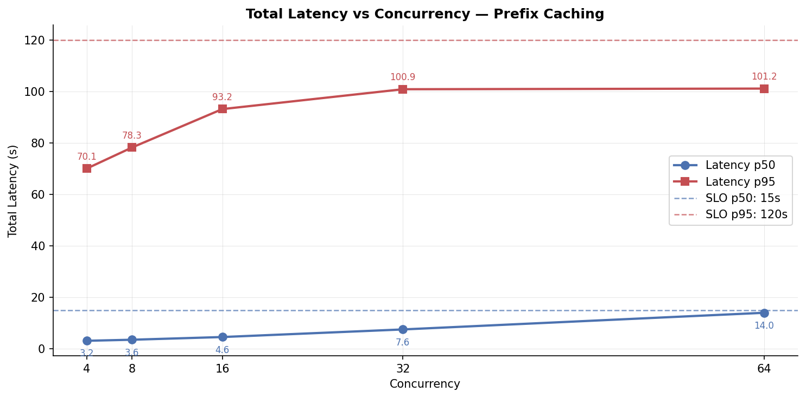
    


```python
rpm = sweep_df["throughput_rps"].values * 60

fig, ax = plt.subplots(figsize=(10, 5))

ax.plot(conc, rpm, "o-", color="#55A868", linewidth=2, markersize=7, label="Throughput (RPM)")
ax.axhline(60.0, color="gray", linestyle="--", linewidth=1.2, label="SLO: 60 RPM")

# Shade SLO violation region
ax.axhspan(0, 60.0, alpha=0.06, color="red")

for xi, v in zip(conc, rpm):
    ax.annotate(f"{v:.1f}", (xi, v), textcoords="offset points", xytext=(0, 10), fontsize=9, ha="center", fontweight="bold", color="#55A868")

ax.set_title("Throughput vs Concurrency — Prefix Caching", fontsize=12, fontweight="bold")
ax.set_xlabel("Concurrency", fontsize=10)
ax.set_ylabel("Requests per Minute", fontsize=10)
ax.set_xticks(conc)
ax.legend(fontsize=10)
ax.grid(alpha=0.3, linewidth=0.5)
ax.spines["top"].set_visible(False)
ax.spines["right"].set_visible(False)

plt.tight_layout()
plt.show()
```


    
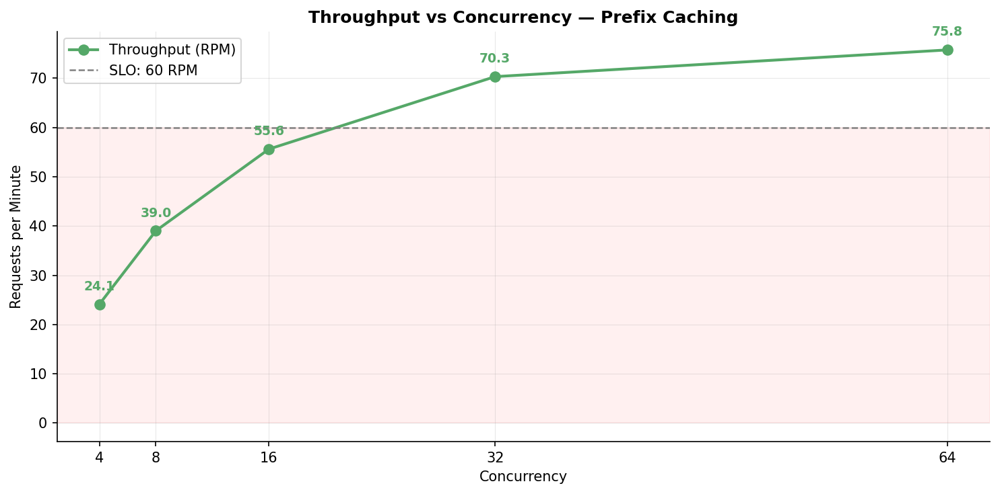
    


### Observation Analysis: Throughput vs. Latency Tradeoff

From concurrency 4 to 64:
- TTFT p50 degraded **2.6 times** (0.63s → 1.61s)
- TTFT p95 degraded **8.2 times** (1.35s → 11.05s)
- Throughput improved **3 times** (0.40 → 1.26 req/s)

More concurrency means higher GPU utilization and more throughput, but each individual request waits longer.
As expected, no free lunches :)

### Where the SLO breaks

- TTFT p95 SLO (< 3s): holds at concurrency 16 (2.60s), **breaks at concurrency 32** (4.87s)
- Throughput SLO (≥ 1.0 req/s): requires concurrency 32 (1.17 req/s) — **concurrency 16 falls short** at 0.93 req/s

This creates a direct tension: the latency SLO and the throughput SLO **cannot both be met at the same concurrency level on a single A10**.

### SLO pass/fail matrix

| SLO | Target | Conc 4 | Conc 8 | Conc 16 | Conc 32 | Conc 64 |
|-----|--------|:------:|:------:|:-------:|:-------:|:-------:|
| TTFT p95 | < 3s | ✅ 1.35 | ✅ 1.55 | ✅ 2.60 | ❌ 4.87 | ❌ 11.05 |
| Total latency p50 | < 15s | ✅ 3.2 | ✅ 3.6 | ✅ 4.6 | ✅ 7.6 | ✅ 14.0 |
| Throughput | ≥ 1.0 req/s | ❌ 0.40 | ❌ 0.65 | ❌ 0.93 | ✅ 1.17 | ✅ 1.26 |
| Error rate | < 1% | ✅ 0% | ✅ 0% | ✅ 0% | ✅ 0% | ✅ 0% |

### The production decision

**Concurrency 16 is the right operating point if latency is the priority**
Reasoning: It meets every SLO except throughput (0.93 vs 1.0 req/s), and only marginally misses the throughput target. 


---

## 8. Model and Instance Justification

### Why Qwen3.5-4B

| Property | What it is | Why it matters for this project |
|----------|-----------|--------------------------------|
| Thinking mode | Native per-request `enable_thinking=true/false` via chat template | Quality/latency tradeoff is a per-request decision without prompt engineering; directly creates the bimodal workload that stresses the scheduler |
| MTP head | Ships with a Multi-Token Prediction head for speculative decoding | No separate draft model needed |
| License | Apache 2.0 | Production-deployable, no usage restrictions |
| Size | 4B parameters, ~8 GB VRAM for weights | Leaves ~16 GB for KV cache on an A10; supports concurrency 32–64 on our sequence lengths |

### Why the A10 GPU

- **VRAM ceiling:** 24 GB handles all four experiment configurations -> baseline peaks at 19.8 GB, MTP-3 peaks at 22.5 GB. A T4 (16 GB) would OOM on MTP-3 and leave only ~8 GB for KV cache on baseline, halving max concurrency.
- **Cost:** At prefix caching config throughput (1.17 req/s, concurrency 32), cost per request is **$0.000261** — well under the $0.001 SLO.
- **The bottleneck is VRAM, not compute:** GPU utilization runs 96–99% across all concurrency levels. The limiting factor here was KV cache capacity, not TFLOPS.


---

## 9. Observability and Dashboards
The monitoring stack runs via `docker compose up -d` from the `monitoring/` directory. Prometheus scrapes nano-serve (`:8765/metrics`) and vLLM (`:8000/metrics`) every 15 seconds. Grafana auto-provisions four dashboards on startup — no manual setup.

Note: Below dashboard screenshots are from a later experiment iteration, when I was trying to throttle GPU memory, firing at a rate of 32 QPS for 120 seconds!

### Dashboard 1: vLLM Config & Health

**Answers:** Is vLLM healthy? How full is the KV cache? Is prefix caching actually working?
Key things to look at:
- Prefix cache hit rate: Climbs up within first few seconds of the mixed workloads as the three system prompts get cached.
- KV cache usage gauge: To monitor memory pressure and understand how MTP speculation is impacting effective batch size.
- Finish reason breakdown: a spike in `length` means `max_tokens` is being hit; Should be mostly `stop` for a healthy workload.

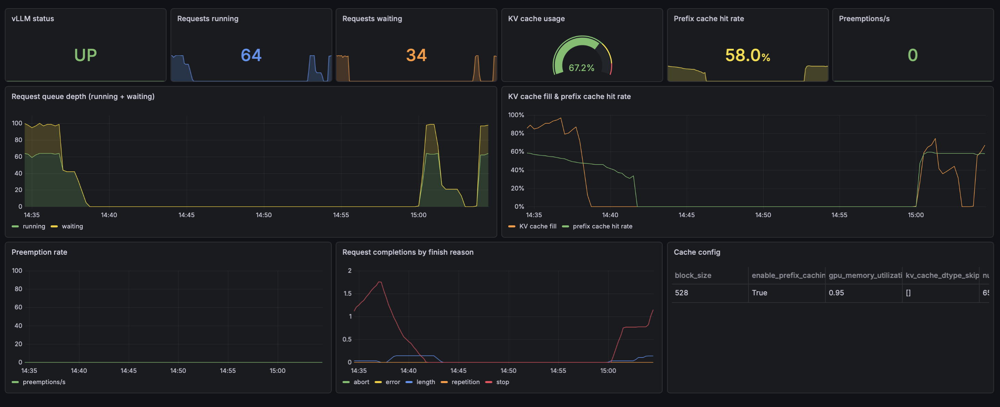


### Dashboard 2: vLLM Engine Performance

**Answers:** What are the raw engine latencies? Where is time going inside vLLM?
Key things to look at:
- **Prefill / decode / queue wait breakdown:** These three components sum to engine-side TTFT. During the QPS sweep, queue wait is the component that exploded: requests spend most of their TTFT waiting to be scheduled, not in actual computation
- **Token throughput: ** Generation tok/s; the primary GPU capacity metric

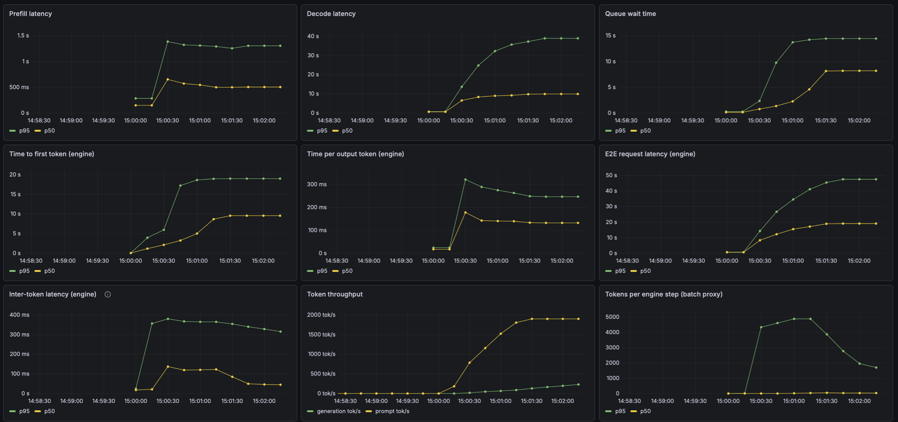

### Dashboard 3: Gateway Operations

**Answers:** What overhead does the gateway add? Which pipeline stages are generating traffic? Are errors spiking?
Key things to look at:
- **TTFT: Gateway vs Engine: ** Both series on the same chart; the gap between them is the pure infrastructure cost (nginx + FastAPI + SSH tunnel + async HTTP). In practice: 10–50ms, confirming the gateway is not a meaningful bottleneck
- **Error rate panel: **`errors / requests`, color-coded green/yellow/red; at high QPS load tests this is where the first signs of overload appear
- **Request rate by technique: ** Stacked area: classify / generate / gate; shows pipeline composition over time

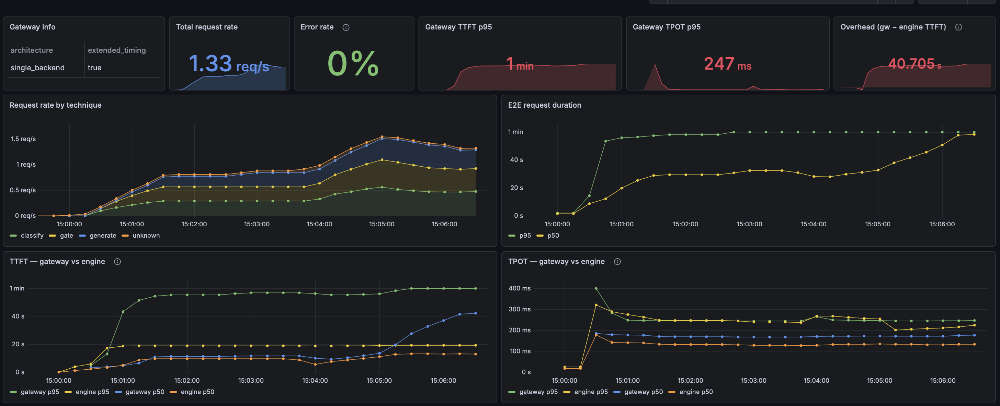


### Dashboard 4: Pipeline Techniques

**Answers:** How does each pipeline stage perform independently?
Key things to look at:
- Three clean lines per chart: classify (fast, ~0.5–1s TTFT), generate (slow, 2–8s with a long tail), gate (medium, ~0.8–2s)
- A `$percentile` dropdown variable (p50 / p95 / p99) updates every histogram panel simultaneously, switching to p99 immediately shows how the tail differs across stages (at p99, generate dominates everything else by 10×)

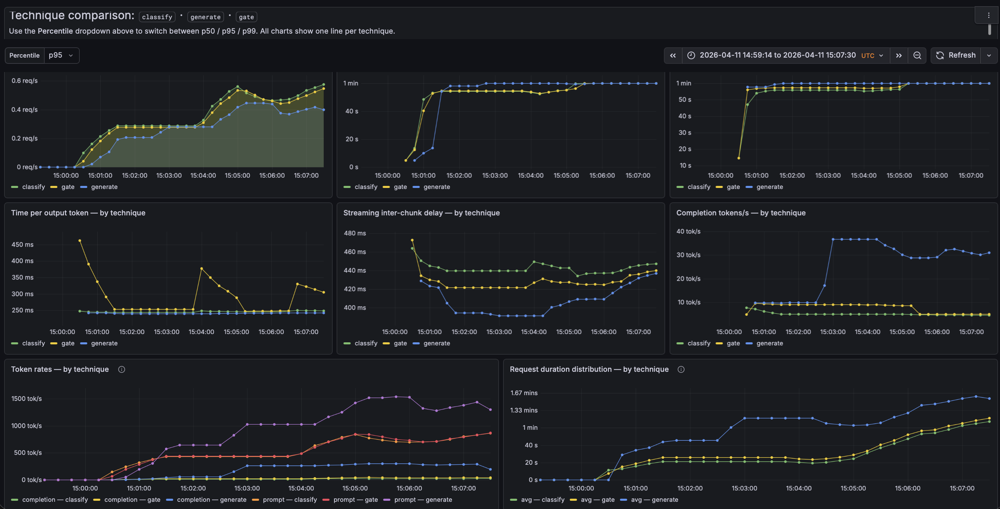


## 10. InferenceOps: When Things Break

My ideas for debugging a similar inference infrastructure in production.This table maps symptoms to how to perform diagnostics.

| Symptom | Check first | What to look at | Likely layer |
|---------|------------|-----------------|-------------|
| TTFT spikes, GPU utilization low | SSH tunnel dropped or gateway queueing | Gateway TTFT vs engine TTFT, if gateway is high but engine is low, bottleneck is between them | Gateway / Tunnel |
| TTFT spikes, GPU high, KV cache > 90% | KV cache pressure | `vllm:gpu_cache_usage_perc`, `vllm:num_requests_waiting` — requests waiting = engine can't schedule due to full cache | vLLM engine |
| TTFT spikes, GPU high, KV cache < 70% | Long prefills blocking the scheduler | Heavy generate requests with thinking mode starving classify requests of scheduling slots | vLLM scheduler |
| Throughput plateau despite low per-request latency | Client concurrency too low to saturate GPU | `vllm:num_requests_running` vs `max_num_seqs` — if consistently below max, there's unused headroom | Client config |
| Prefix cache hit rate stuck at 0% | Caching disabled or prompts not actually shared | Verify `--enable-prefix-caching` flag; check that system prompts are byte-for-byte identical (a single character difference breaks the cache) | vLLM config |


---

## 11. Reflection
### Quick Debugging Story:

- During an early benchmark run, p50 total latency was 115s at concurrency 8: absurdly high for a 4B model. GPU utilization was 98%, but something was wrong.

- Root Cause: Qwen3.5-4B defaults to thinking mode ON for all requests. The inference gateway doesnt accept/ neither was workload sending `enable_thinking: false` for classify and gate requests. Every single "what category is this ticket?" classification was generating hundreds of chain-of-thought reasoning tokens before the JSON output.

- Takeaway
    - Know default behaviors of your model, especially when trying fancy features like thinking mode or MTP.
    - As they might silently change your workload profile. 

- Note: Eventually, I explicitly set `enable_thinking: false` in the workload JSONL for classify and gate requests via `chat_template_kwargs`.

## 12. Next Steps

- Perform similar benchmarking experiments on SG Lang
- Utilise LMCache for disaggregated prefilling, CPU offloading and KV cache sharing 
- Explore distributed serving for very large models that don't fit on a single GPU


